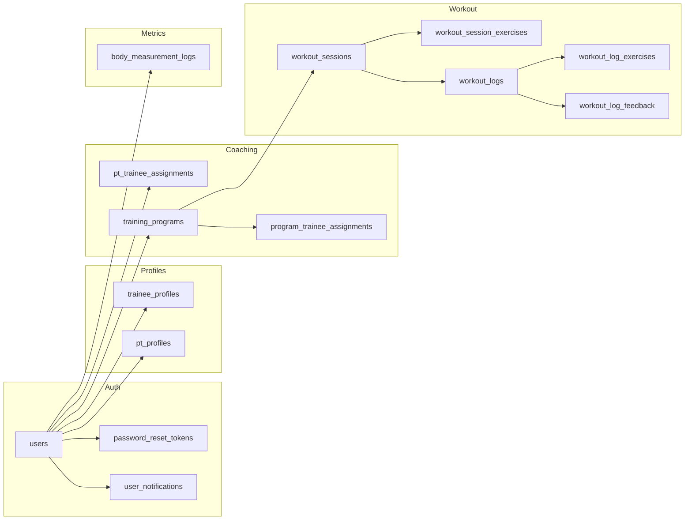

## Export dbdiagram.io

File DBML: [`needforfit.dbml`](./needforfit.dbml)

1. Mở [dbdiagram.io](https://dbdiagram.io/d)
2. **Import** → chọn file `docs/needforfit.dbml`, hoặc copy toàn bộ nội dung file vào editor
3. Diagram render tự động; có thể **Export** PNG/PDF/SQL từ menu


Nguồn: `backend/prisma/schema.prisma` (đồng bộ với DB `needforfit` sau `prisma db push`).

## Tổng quan

```mermaid
erDiagram
  users ||--o{ password_reset_tokens : "1:N"
  users ||--o{ user_notifications : "1:N"
  users ||--o| trainee_profiles : "1:0..1"
  users ||--o| pt_profiles : "1:0..1"
  users ||--o{ pt_trainee_assignments : "PT (pt_id)"
  users ||--o{ pt_trainee_assignments : "Trainee (trainee_id)"
  users ||--o{ training_programs : "PT owns"
  users ||--o{ workout_logs : "trainee"
  users ||--o{ workout_logs : "PT reviews"
  users ||--o{ body_measurement_logs : "trainee"

  training_programs ||--o{ program_trainee_assignments : "1:N"
  training_programs ||--o{ workout_sessions : "1:N"

  workout_sessions ||--o{ workout_session_exercises : "1:N"
  workout_sessions ||--o{ workout_logs : "1:N"

  workout_logs ||--o{ workout_log_exercises : "1:N"
  workout_logs ||--o| workout_log_feedback : "1:0..1"

  users {
    uuid id PK
    string email UK
    string password_hash
    enum role "admin|pt|trainee"
    enum status "pending|active|inactive|deleted"
    enum preferred_language
    datetime created_at
    datetime updated_at
  }

  password_reset_tokens {
    uuid id PK
    uuid user_id FK
    string token UK
    datetime expires_at
    datetime used_at
  }

  user_notifications {
    uuid id PK
    uuid user_id FK
    string type
    string title
    string body
    json payload
    datetime read_at
  }

  trainee_profiles {
    uuid id PK
    uuid user_id FK UK
    date date_of_birth
    decimal height_cm
    decimal current_weight_kg
    enum goal
    string injury_history
  }

  pt_profiles {
    uuid id PK
    uuid user_id FK UK
    string bio
    string specialization
    int years_experience
    string certifications
  }

  pt_trainee_assignments {
    uuid id PK
    uuid pt_id FK
    uuid trainee_id FK
    enum status "invite_pending|active|..."
    datetime assigned_at
    datetime paused_at
    datetime ended_at
  }

  training_programs {
    uuid id PK
    uuid pt_id FK
    string name
    enum program_type
    enum status "draft|active|..."
    int duration_weeks
    date start_date
    date end_date
  }

  program_trainee_assignments {
    uuid id PK
    uuid program_id FK
    uuid trainee_id "indexed, no Prisma FK to users"
    datetime assigned_at
  }

  workout_sessions {
    uuid id PK
    uuid program_id FK
    string name
    enum session_type
    date scheduled_date
    enum status
    int session_version
  }

  workout_session_exercises {
    uuid id PK
    uuid session_id FK
    string exercise_name
    int planned_sets
    int planned_reps
    decimal planned_weight_kg
    int order_index
    int block_index
    enum block_type "normal|superset|dropset"
    int session_version
  }

  workout_logs {
    uuid id PK
    uuid session_id FK
    uuid trainee_id FK
    uuid pt_id FK
    date workout_date
    enum status "completed|locked"
    datetime locked_at
  }

  workout_log_exercises {
    uuid id PK
    uuid log_id FK
    string exercise_name
    int actual_sets
    int actual_reps
    decimal actual_weight_kg
  }

  workout_log_feedback {
    uuid id PK
    uuid log_id FK UK
    int difficulty_rating
    int fatigue_rating
    boolean pain_or_discomfort
    json template_responses
  }

  body_measurement_logs {
    uuid id PK
    uuid trainee_id FK
    date measurement_date
    decimal weight_kg
    decimal body_fat_percent
    decimal muscle_mass_kg
    json measurements_json
    enum status "completed|locked"
  }
```

## Luồng nghiệp vụ chính



## Ràng buộc đáng chú ý

| Bảng | Ràng buộc |
|------|-----------|
| `workout_logs` | `UNIQUE (session_id, trainee_id)` — mỗi trainee một log / session |
| `program_trainee_assignments` | `UNIQUE (program_id, trainee_id)` |
| `workout_log_feedback` | `log_id` unique — tối đa một feedback / log |
| `trainee_profiles`, `pt_profiles` | `user_id` unique — một profile / user |

## Enum (tham khảo)

- **UserRole:** admin, pt, trainee  
- **AssignmentStatus:** invite_pending, invite_rejected, active, paused, ended  
- **ProgramStatus:** draft, active, paused, completed, archived  
- **SessionStatus:** draft, active, paused, completed  
- **WorkoutLogStatus / BodyMetricStatus:** completed, locked  
